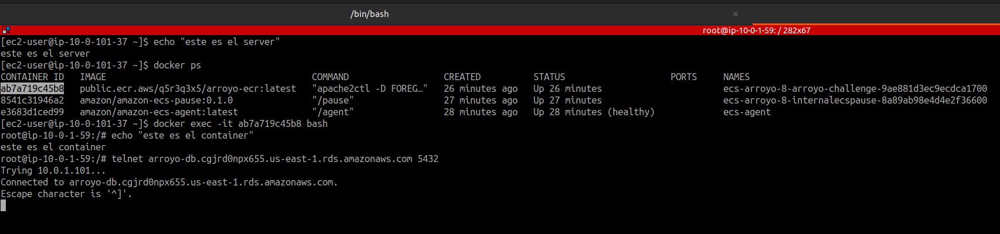

# Arroyo challenge

El challenge consistia en crear un entorno de terraform que cumpliera con los siguientes requisitos:

> Construir un proyecto en Terraform que permita crear una
> infraestructura en AWS que cumpla con los siguientes requisitos:
>
> 1.  Crear un servicio de cómputo con SO Linux (EC2, ECS, EKS, etc…).
> 2.  Crear un servicio de base de datos (RDS, DynamoDB, Aurora, etc …).
> 3.  Crear políticas de seguridad para el acceso SSH (por ejemplo, restricción de IPs).
> 4.  Construir una imagen de Docker con SO Linux y publicarla, la imagen debe contar con las siguientes especificaciones:
> 5.  Montar la imagen de Docker creada en el servicio de computo elegido en el paso 1
>
> - Instalar Git
> - Instalar Vs Code
> - Instalar Maven
> - Instalar PostgreSQL
> - Instalar Java JRE
> - Debe poder compilar proyectos NetCore
> - Debe poder compilar aplicaciones Java
> - Subir un servidor apache con un “hola mundo” o cualquier proyecto público.
>
> NOTA:
>
> - Debe haber conexión entre el Docker y el servicio de base de datos elegido.
> - Debe ser elaborado en una cuenta propia (debe explorar sus opciones).
> - Concedernos acceso a la imagen de Docker publicada.
> - Concedernos acceso a los archivos de Terraform creados.
> - Justificar la escogencia del tipo de servicio de computo y base de datos elegidos.
> - Es un plus cualquier configuración adicional realizada.

Todos los pasos fueron completados satisfactoriamente. Aqui dejare algunas observaciones y respuesta a las preguntas mencionadas.

- Debe haber conexión entre el Docker y el servicio de base de datos
  elegido.

- Concedernos acceso a la imagen de Docker publicada.

public-ecr: https://gallery.ecr.aws/q5r3q3x5/arroyo-ecr

my-docker-hub: https://hub.docker.com/r/adamdanielf/challenges/tags

- Concedernos acceso a los archivos de Terraform creados.

https://github.com/adamdaniel2993/arroyo-challenge

- Justificar la escogencia del tipo de servicio de computo y base de datos elegidos.

Sencillez:

ECS: con ECS, AWS maneja la infraestructura subyacente. Usted define los requisitos de su aplicación y ECS se encarga de la ubicación, el escalado y la administración. Para los usuarios que ya están acostumbrados a AWS, la integración con otros servicios de AWS puede simplificar la sobrecarga operativa.

Costo:

ECS: con ECS, especialmente cuando se combina con AWS Fargate, solo paga por lo que usa sin preocuparse por la infraestructura subyacente. Fargate abstrae por completo la gestión de instancias.

Escalamiento:

ECS: ofrece capacidades de escalado automático tanto para tareas (contenedores) como para servicios.

Mantenimiento:

ECS: AWS administra la infraestructura subyacente, lo que reduce los gastos generales de mantenimiento.

Siempre digo Facil > Complicado, se que es menos robusto que EKS pero si comparamos el resultado final vs el la curva de aprendizaje y esfuerzo ECS es realmente un 100 a la hora de correr escenarios normales

- Base de datos

Con el tema de la base de datos no tengo mucho que explicar mas que decir que postgres es la base de datos por excelencia en AWS consta con todos los features, desde read or write replica, hasta poin in time recovery, multi-AZ entre otros es una base de datos muy completa
